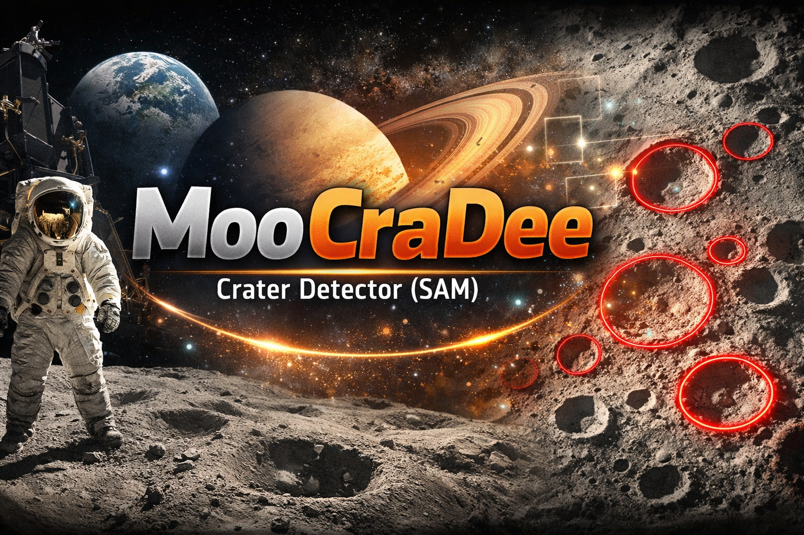

# MooCraDee — Crater Detector (SAM)

<p align="center">
  
</p>

<p align="center">
  <b>Detect craters in images using Segment Anything (SAM)</b><br/>
  Fits a circle to each accepted mask and exports an annotated image + CSV (x, y, radius).
</p>

<p align="center">
  
  
  
  
</p>

---

## What it does

Given a crater image, **MooCraDee** uses **Segment Anything (SAM)** to segment crater-like regions, then:
- **fits a circle** to each accepted mask
- writes an **output image** with **red circles**
- saves a **CSV** with crater parameters: **(x, y, radius)**

---
Results after testing beta 1
<p align="center">
  
  
</p>

<p align="center"><b>Left:</b> input image. <b>Right:</b> detected craters + circle fits.</p>

---

## Requirements

- **Python:** 3.10–3.12  
- **OS:** Ubuntu recommended (works on other Linux/macOS if deps install)  
- **Hardware:** CPU works; **GPU + CUDA** optional for speed  
- **Model:** SAM checkpoint file (e.g., `sam_vit_b_01ec64.pth`)

---

## Setup

```bash
git clone https://github.com/dajuarez4/MooCraDee.git
cd MooCraDee

conda create -n craterdl python=3.11 -y
conda activate craterdl
pip install opencv-python numpy torch torchvision
pip install git+https://github.com/facebookresearch/segment-anything.git
wget -O sam_vit_b_01ec64.pth https://dl.fbaipublicfiles.com/segment_anything/sam_vit_b_01ec64.pth

 python deep_moocrade.py  find_jackson_crater.png    --ckpt sam_vit_b_01ec64.pth   --out sam_out.png --csv sam_radii.csv   --min_radius 20 --max_radius 260   --min_circularity 0.35   --min_area 600   --pps 64 --pred_iou 0.80 --stability 0.85   --iou_dedup 0.12
```

## Command parameters (what each one does)

### Required inputs

**`scripts/deep_moocrade.py`**  
The script you run.

**`find_jackson_crater.png`**  
Input image path (use the original image, not already annotated).

**`--ckpt sam_vit_b_01ec64.pth`**  
Path to the Segment Anything (SAM) checkpoint (`.pth`) containing model weights.

---

### Outputs

**`--out sam_out.png`**  
Output image file (input image with detected craters drawn as **red circles**).

**`--csv sam_radii.csv`**  
Output CSV file with detections (`x_px`, `y_px`, `radius_px`, and `score`).

---

### Circle size limits (pixels)

**`--min_radius 20`**  
Minimum allowed crater radius (px).  
Lower → detects smaller craters but increases false positives and duplicates.

**`--max_radius 260`**  
Maximum allowed crater radius (px).  
Lower → prevents huge circles that cover multiple structures.

---

### Mask filtering (shape/size of SAM masks)

**`--min_circularity 0.35`**  
Minimum “circle-likeness” for a mask. Computed as:

\[
\text{circularity}=\frac{4\pi A}{P^2}
\]

where `A` is mask area and `P` is mask perimeter.  
`1.0` is a perfect circle; smaller values are more irregular.  
Higher → stricter (fewer detections). Lower → more detections (more noise).

**`--min_area 600`**  
Minimum mask area (px²).  
Higher → removes tiny noisy regions; lower → keeps more small candidates.

---

### SAM generation controls (speed vs coverage)

**`--pps 64`** *(points_per_side)*  
Grid density for SAM’s automatic mask proposals.  
Higher → more masks (better coverage) but much slower.  
Typical presets:
- `16` = fast  
- `32` = balanced  
- `64` = thorough (slow)

**`--pred_iou 0.80`**  
Minimum predicted IoU quality threshold for SAM masks.  
Higher → fewer, higher-confidence masks.  
Lower → more masks (more false positives).

**`--stability 0.85`**  
Minimum stability score threshold for SAM masks.  
Higher → fewer, more reliable masks.  
Lower → more masks (noisier).

---

### Duplicate removal

**`--iou_dedup 0.12`**  
Removes duplicate circles using circle overlap IoU.  
Lower → more aggressive dedup (keeps fewer circles).  
Higher → allows more overlapping circles (can keep “double detections”).

