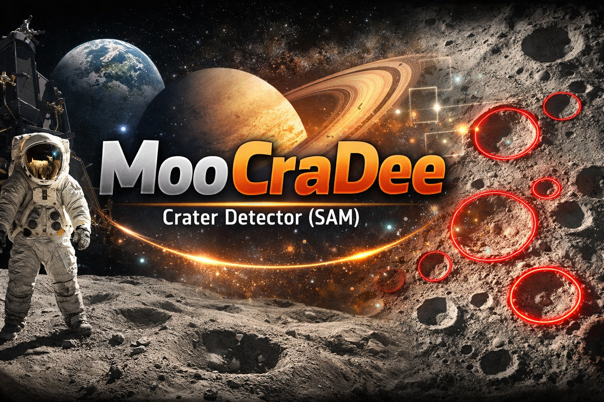
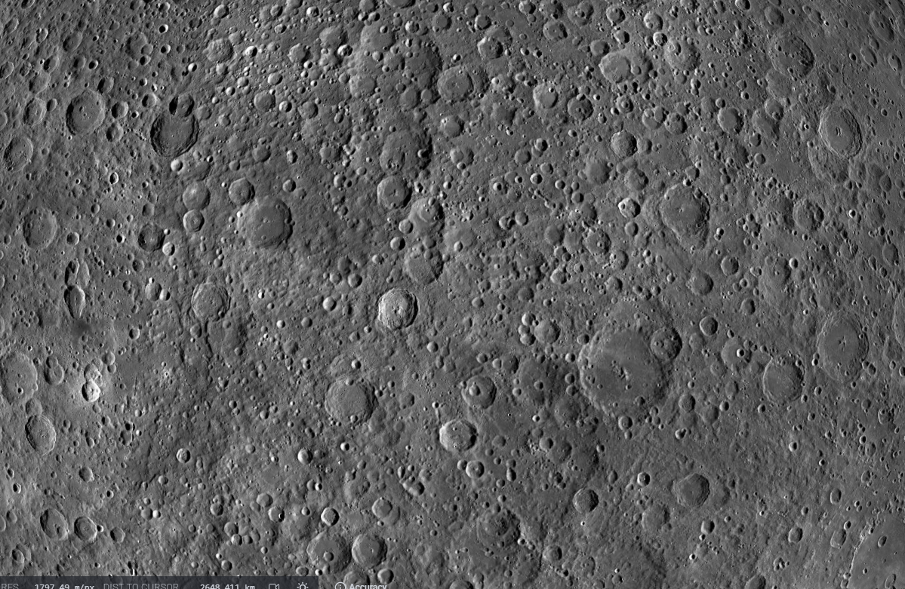
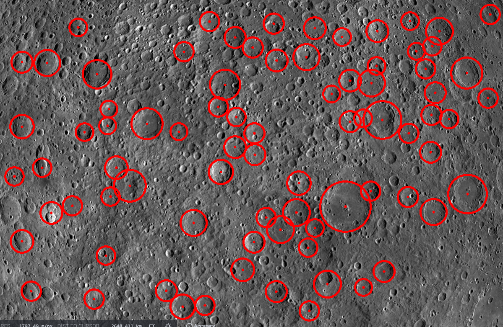
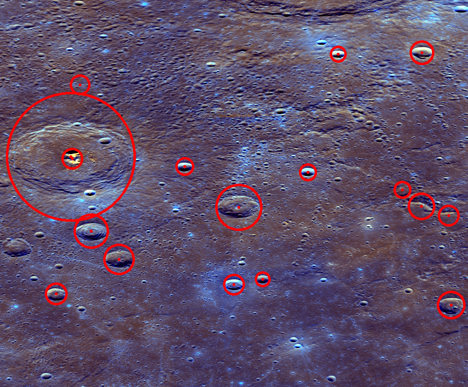

# PCS: Planetary Crater Segmentation

PCS is a continuing development of the MooCraDee project, with a focus on making the crater-detection workflow reproducible and accessible through a GPU-enabled Google Colab notebook.

This version keeps the original purpose of exploring crater detection in planetary imagery while adding a structured workflow for running experiments, testing images, adjusting parameters, visualizing results, and preparing outputs that can support future crater-candidate database development.

# MooCraDee — Crater Detector (SAM)

<p align="center">
  
</p>

<p align="center">
  <b>Detect craters in images using Segment Anything (SAM)</b><br/>
  Fits a circle to each accepted mask and exports an annotated image + CSV (x, y, radius).
</p>

<p align="center">
  
  
  
  
</p>

---

## What it does

Given a crater image, **MooCraDee** uses **Segment Anything (SAM)** to segment crater-like regions, then:
- **fits a circle** to each accepted mask
- writes an **output image** with **red circles**
- saves a **CSV** with crater parameters: **(x, y, radius)**

---
Results after testing beta 1
<p align="center">
  
  
</p>

<p align="center"><b>upper panel:</b> input image. <b>lower panel:</b> detected craters + circle fits.</p>

---

## Mercury Example

<p align="center">
  
</p>

<p align="center"><b>Mercury output:</b> crater detections and fitted circles from a Mercury test image.</p>

---

## Requirements

- **Python:** 3.10–3.12  
- **OS:** Ubuntu recommended (works on other Linux/macOS if deps install)  
- **Hardware:** CPU works; **GPU + CUDA** optional for speed  
- **GPU runtime:** NVIDIA GPU + CUDA drivers + a CUDA-enabled PyTorch install  
- **Model:** SAM checkpoint file (e.g., `sam_vit_b_01ec64.pth`)

---

## Setup

```bash
git clone https://github.com/dajuarez4/MooCraDee.git
cd MooCraDee

conda create -n craterdl python=3.11 -y
conda activate craterdl
pip install opencv-python numpy torch torchvision
pip install git+https://github.com/facebookresearch/segment-anything.git
wget -O sam_vit_b_01ec64.pth https://dl.fbaipublicfiles.com/segment_anything/sam_vit_b_01ec64.pth

python deep_moocrade.py assets/find_jackson_crater.png --ckpt sam_vit_b_01ec64.pth --out examples/jackson/sam_out.png --csv examples/jackson/sam_radii.csv --min_radius 20 --max_radius 260 --min_circularity 0.35 --min_area 600 --pps 64 --pred_iou 0.80 --stability 0.85 --iou_dedup 0.12
```

## CPU and GPU Execution

MooCraDee is already GPU-enabled through **PyTorch CUDA**. The script automatically selects:

- **`cuda`** when `torch.cuda.is_available()` is `True`
- **`cpu`** otherwise

There is no separate flag to switch modes. To run on GPU:

1. Use a machine with an **NVIDIA GPU**.
2. Install the correct **NVIDIA/CUDA drivers**.
3. Install a **CUDA-enabled PyTorch** build for your system.
4. Run the same `python deep_moocrade.py ...` command.

The script prints the selected device at runtime:

- `Device: cuda` = GPU is active
- `Device: cpu` = it fell back to CPU

You can verify that PyTorch sees the GPU with:

```bash
python3 -c "import torch; print(torch.cuda.is_available()); print(torch.cuda.device_count()); print(torch.cuda.get_device_name(0) if torch.cuda.is_available() else 'no gpu')"
```

## Command parameters (what each one does)

### Required inputs

**`deep_moocrade.py`**  
The script you run.

**`assets/find_jackson_crater.png`**  
Input image path (use the original image, not already annotated).

**`--ckpt sam_vit_b_01ec64.pth`**  
Path to the Segment Anything (SAM) checkpoint (`.pth`) containing model weights.

---

### Outputs

**`--out examples/jackson/sam_out.png`**  
Output image file (input image with detected craters drawn as **red circles**).

**`--csv examples/jackson/sam_radii.csv`**  
Output CSV file with detections (`x_px`, `y_px`, `radius_px`, and `score`).

---

### Circle size limits (pixels)

**`--min_radius 20`**  
Minimum allowed crater radius (px).  
Lower → detects smaller craters but increases false positives and duplicates.

**`--max_radius 260`**  
Maximum allowed crater radius (px).  
Lower → prevents huge circles that cover multiple structures.

---

### Mask filtering (shape/size of SAM masks)

**`--min_circularity 0.35`**  
Minimum “circle-likeness” for a mask. Computed as:

$$
\text{circularity} = \frac{4 \pi A}{P^2}
$$

where `A` is mask area and `P` is mask perimeter.  
`1.0` is a perfect circle; smaller values are more irregular.  
Higher → stricter (fewer detections). Lower → more detections (more noise).

**`--min_area 600`**  
Minimum mask area (px²).  
Higher → removes tiny noisy regions; lower → keeps more small candidates.

---

### SAM generation controls (speed vs coverage)

**`--pps 64`** *(points_per_side)*  
Grid density for SAM’s automatic mask proposals.  
Higher → more masks (better coverage) but much slower.  
Typical presets:
- `16` = fast  
- `32` = balanced  
- `64` = thorough (slow)

**`--pred_iou 0.80`**  
Minimum predicted IoU quality threshold for SAM masks.  
Higher → fewer, higher-confidence masks.  
Lower → more masks (more false positives).

**`--stability 0.85`**  
Minimum stability score threshold for SAM masks.  
Higher → fewer, more reliable masks.  
Lower → more masks (noisier).

---

### Duplicate removal

**`--iou_dedup 0.12`**  
Removes duplicate circles using circle overlap IoU.  
Lower → more aggressive dedup (keeps fewer circles).  
Higher → allows more overlapping circles (can keep “double detections”).

---

## Future Work

- UTEP implementation
- Crater distribution for Mercury using the [MESSENGER MDIS enhanced-color global mosaic](https://asc-pds-services.s3.us-west-2.amazonaws.com/mosaic/Mercury_MESSENGER_MDIS_Basemap_EnhancedColor_Mosaic_Global_665m.tif)
